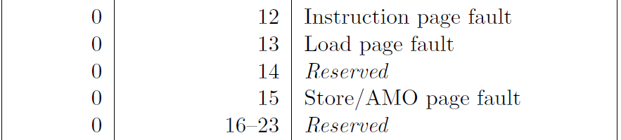
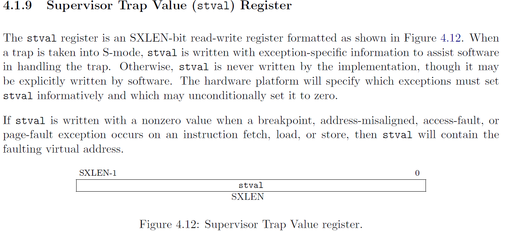

# Lab: Copy-on-Write Fork for xv6

虚拟内存提供了一种间接性：内核可以将 PTE 标记为无效 (invalid) 或者只读 (read-only) 来阻止内存引用，并且导致页面故障 (page faults) 。在计算机系统中有一个说法，任何系统问题都能通过一定的间接性来解决。本次实验探索了一个例子：写时复制 (copy-on-write) fork.

开始之前切换到 `cow` 分支：

```bash
git fetch
git checkout cow
make clean
```

## 问题描述

xv6 中的 `fork()` 系统调用将父进程的所有用户空间内存都拷贝到子进程。如果父进程很大，那么这种拷贝将会花费很长时间。更糟糕的是，这经常会出现很大的浪费，因为 `fork()` 在子进程中，通常后面跟着 `exec()`，它通常使用已复制内存的很少一部分，这样就浪费了大量的内存空间。

## 解决方法

你的任务是实现写时复制 (copy-on-write) fork()，它可以推迟实际的物理内存的分配，直到真正使用要使用的时候，才会复制物理内存页。

COW fork() 仅仅为子进程创建了一个页表 (pagetable) ，页表中映射用户内存的 PTE 实际指向的是父进程的物理页。COW fork() 将父进程和子进程的用户 PTEs(user PTEs) 标记为只读 (read-only)。当任何一个进程试图向 COW 页写入操作的时候，CPU 将会引发一个页面错误 (page fault)。内核中的页面错误处理函数将会检测到这种情况，为发生错误的进程分配一个物理内存页，并把原始页（也就是父进程和子进程共享的物理页）中的数据复制到新分配的页中，然后修改故障进程中相关的 PTE ，使其指向新分配的物理页的地址，最后将此 PTE 标记为可写 (writeable)。 错误页面处理函数完成任务之后，用户进程对于它的复制页将是可写的。

COW fork() 使得用户内存的物理页面的释放变得稍微有些复杂。一个给定的物理页有可能同时被多个进程所引用，这是因为由于 COW 的延迟分配机制，父进程和子进程共享同一个物理页所导致的。所以，我们应该在释放一个物理页的时候，确保该物理页没有一个进程在使用。在 xv6 这种简单内核中，我们的实现非常直接简单，仅仅使用一个数组来进行标记。但是在成熟内核中，这可能很难做到。

## Implement copy-on-write fork([hard](https://pdos.csail.mit.edu/6.828/2022/labs/guidance.html))

> 你的任务是在 xv6 内核中实现 copy-on-write fork 。如果运行 `cowtest` 和 `usertests -q` 都成功，那么这个实验就成功了。

为了帮助你测试你的代码，我们提供了一个 `cowtest` xv6 程序（源代码在 `user/cowtest.c`。它将会运行多个测试，在没有修改的 xv6 中，它将会在第一个测试中就失败。

```bash
$ cowtest
simple: fork() failed
$ 
```

这个 "simple" 测试会分配超过一半的可用物理内存，然后调用 `fork()` 。由于此时没有实现 COW fork() ，所以这里会因为没有足够的空闲内存空间而发生失败。

当你完成的时候，运行这两个测试程序，应该显示如下结果：

```bash
$ cowtest
simple: ok
simple: ok
three: zombie!
ok
three: zombie!
ok
three: zombie!
ok
file: ok
ALL COW TESTS PASSED
$ usertests -q
...
ALL TESTS PASSED
$
```

下面是一些建议：

1. 修改 `uvmcopy()` ，将父进程的物理页映射到子进程，以避免分配新的页。同时清楚子进程和父进程 PTE 的 PTE_W 位，使它们标记为不可写。
2. 修改 `usertrap()` ，以此来处理页面错误 (page fault)。当在一个本来可写的 COW 页发生“写页面错误” (write page-falut) 的时候，使用 `kalloc()` 分配一个新的页，将旧页中的数据拷贝到新页中，并将新页的 PTE 的 PTE_W 位置为1. **值得注意的是，对于哪些本来就使只读的（例如代码段），不论在旧页还是新页中，应该依旧保持它的只读性，那些试图对这样一个只读页进行写入的进程应该被杀死。**
3. 确保没有一个物理页被 PTE 引用之后，再释放它们，不能提前释放。一个好的做法是，维持一个“引用计数数组” (reference count) ，使用索引代表对应的物理页，值代表被引用的个数。当调用 `kalloc()` 分配一个物理页的时候，将其 `reference count` 设置为 `1` 。当 `fork` 导致子进程共享同一个页的时候，递增其页的引用计数；当任何一个进程从它们的页表中舍弃这个页的时候，递减其页的引用计数。`kfree()` 仅当一个页的引用计数为零时，才将这个页放到空闲页列表中。将这些引用计数放到一个 int 类型的数组中是可以的，你必须思考，如何去索引这个数组，以及如何选择这个数组的大小。例如，你可以用一个 `页的物理地址/4096` 来索引数组。
4. 修改 `copyout()` ，使用类似的思路去处理 COW 页。

一些注意的点：

1. 记录一个 PTE 是否是 COW 映射是有帮助的。你可以使用 RISC-V PTE 的 RSW (reserved for software) 位来指示。
2. `usertests -q` 测试一些 `cowtest` 没有测试的东西，所以不要忘记两个测试都要通过。
3. 一些对于页表标志 (page table flags) 有用的宏和定义可以在 `kernel/riscv.h` 中找到。
4. 如果一个 COW 页错误发生时，没有剩余可用内存，那么该进程应该被杀死。

## 思路

首先需要处理引用计数的问题。在 `kernel/kalloc.c` 中定义一个全局变量和锁。

```cpp
// the reference count of physical memory page
int useReference[PHYSTOP/PGSIZE];
struct spinlock ref_count_lock;
```

然后在函数 `kalloc()` 中，初始化新分配的物理页的引用计数为 1.

```cpp
void *
kalloc(void)
{
  ...
  if(r) {
    kmem.freelist = r->next;
    acquire(&ref_count_lock);
    // initialization the ref count to 1
    useReference[(uint64)r / PGSIZE] = 1;
    release(&ref_count_lock);
  }
  release(&kmem.lock);
  ...
}
```

接着修改 `kfree()` ，仅当引用计数小于等于 0 的时候，才回收对应的页。

```cpp
void
kfree(void *pa)
{
  ...
  if(((uint64)pa % PGSIZE) != 0 || (char*)pa < end || (uint64)pa >= PHYSTOP)
    panic("kfree");

  acquire(&ref_count_lock);
  // decrease the reference count, if use reference is not zero, then return
  useReference[(uint64)pa/PGSIZE] -= 1;
  temp = useReference[(uint64)pa/PGSIZE];
  release(&ref_count_lock);
  if (temp > 0)
    return;

  // Fill with junk to catch dangling refs.
 ...
}
```

之所以不使用 `if (temp != 0)` ，因为在系统运行开始的时候，需要对空闲页列表 (kmem.freelist) 进行初始化，此时的引用计数就为 `-1` ，如果条件为 `temp != 0` 那么这些空闲页就不能够回收，也就不能够 `kmem.freelist` 列表了。

`fork` 会首先调用 `uvmcopy()` 给子进程分配内存空间。但是如果要实现 COW 机制，就需要在 fork 时不分配内存空间，而是让子进程和父进程同时共享父进程的内存页，并将其设置为只读，使用 PTE_RSW 位标记 COW 页。这样子进程没有使用到某些页的时候，系统就不会真正的分配物理内存。**注意，此时需要将对应的引用计数加一。**

> 这里在修改 PTE_W 和 PTE_RSW 位的时候，需要考虑原本的页是否使可写的。如果原本的页是只读的，那么就不用将其修改为 COW 页，因为 COW 页会在 `usertrap()` 中重新分配内存，并赋予可写权限，这样就违背了其原来的意愿，导致安全问题。
>
> 只有原本的页是可写的，才将其标记为 COW 和只读。

首先在 `kernel/riscv.h` 中增加一些定义。

```cpp
#define PTE_RSW (1L << 8) // RSW
```

然后修改 `uvmcopy` 函数。此函数在 `vm.c` 文件中，由于需要使用 `useReference` 引用计数，所以需要提前在文件开头声明。

```cpp
#include "spinlock.h"
#include "proc.h"

// Just declare the variables from kernel/kalloc.c
extern int useReference[PHYSTOP/PGSIZE];
extern struct spinlock ref_count_lock;

int
uvmcopy(pagetable_t old, pagetable_t new, uint64 sz)
{
  ...
  // char *mem;
  for(i = 0; i < sz; i += PGSIZE){
    if((pte = walk(old, i, 0)) == 0)
      panic("uvmcopy: pte should exist");
    if((*pte & PTE_V) == 0)
      panic("uvmcopy: page not present");
    // PAY ATTENTION!!!
    // 只有父进程内存页是可写的，才会将子进程和父进程都设置为COW和只读的；否则，都是只读的，但是不标记为COW，因为本来就是只读的，不会进行写入
    // 如果不这样做，父进程内存只读的时候，标记为COW，那么经过缺页中断，程序就可以写入数据，于原本的不符合
    if (*pte & PTE_W) {
      // set PTE_W to 0
      *pte &= ~PTE_W;
      // set PTE_RSW to 1
      // set COW page
      *pte |= PTE_RSW;
    }
    pa = PTE2PA(*pte);

    // increment the ref count
    acquire(&ref_count_lock);
    useReference[pa/PGSIZE] += 1;
    release(&ref_count_lock);

    flags = PTE_FLAGS(*pte);
    // if((mem = kalloc()) == 0)
    //   goto err;
    // memmove(mem, (char*)pa, PGSIZE);
    if(mappages(new, i, PGSIZE, (uint64)pa, flags) != 0){
      // kfree(mem);
      goto err;
    }
  }
  ...
}
```

一旦子进程真正需要某些页，由于页被设置为只读的，此时会触发 Store/AMO page fault，scause 寄存器的值为 15。



在  `usertrap()` 函数中捕获到 Store/AMO page fault 错误之后开始处理。首先应该知道哪个虚拟地址的操作导致了页错误。RISC-V 中的 stval (Supervisor Trap Value (stval) Register ) 寄存器中的值是导致发生异常的虚拟地址。vx6 中的函数 `r_stval()` 可以获取该寄存器的值。



修改 `usertrap` 函数。

```cpp
void
usertrap(void)
{
  ...
  syscall();
  }
  else if (r_scause() == 15) {
    // Store/AMO page fault(write page fault)
    // see Volume II: RISC-V Privileged Architectures V20211203 Page 71

    // the faulting virtual address
    // see Volume II: RISC-V Privileged Architectures V20211203 Page 70
    // the download url is https://github.com/riscv/riscv-isa-manual/releases/download/Priv-v1.12/riscv-privileged-20211203.pdf
    uint64 va = r_stval();
    if (va >= p->sz)
      p->killed = 1;
    int ret = cowhandler(p->pagetable, va);
    if (ret != 0)
      p->killed = 1;
  } else if((which_dev = devintr()) != 0){
    // ok
  } else {
  ...
 }
```

定义 `cowhandler` 函数。

```cpp
int
cowhandler(pagetable_t pagetable, uint64 va)
{
    char *mem;
    if (va >= MAXVA)
      return -1;
    pte_t *pte = walk(pagetable, va, 0);
    if (pte == 0)
      return -1;
    // check the PTE
    if ((*pte & PTE_RSW) == 0 || (*pte & PTE_U) == 0 || (*pte & PTE_V) == 0) {
      return -1;
    }
    if ((mem = kalloc()) == 0) {
      return -1;
    }
    // old physical address
    uint64 pa = PTE2PA(*pte);
    // copy old data to new mem
    memmove((char*)mem, (char*)pa, PGSIZE);
    // PAY ATTENTION
    // decrease the reference count of old memory page, because a new page has been allocated
    kfree((void*)pa);
    uint flags = PTE_FLAGS(*pte);
    // set PTE_W to 1, change the address pointed to by PTE to new memory page(mem)
    *pte = (PA2PTE(mem) | flags | PTE_W);
    // set PTE_RSW to 0
    *pte &= ~PTE_RSW;
    return 0;
}
```

`cowhandler` 要进行严格的检查。只有被标记为 COW，存在，且是属于用户级别的，才可以被分配内存。如果本来的页就是只读的，那么在此时尝试对其进行写入，就会返回 -1，最终被杀死。

接着修改 `kernel.vm.c` 中的 `copyout()` 函数。这里的思路和 `uvmcopy()` 中类似。

```cpp
int checkcowpage(uint64 va, pte_t *pte, struct proc* p) {
  return (va < p->sz) // va should blow the size of process memory (bytes)
    && (*pte & PTE_V) 
    && (*pte & PTE_RSW); // pte is COW page
}

int
copyout(pagetable_t pagetable, uint64 dstva, char *src, uint64 len)
{
    ...
    pa0 = walkaddr(pagetable, va0);
    if(pa0 == 0)
      return -1;

    struct proc *p = myproc();
    pte_t *pte = walk(pagetable, va0, 0);
    if (*pte == 0)
      p->killed = 1;
    // check
    if (checkcowpage(va0, pte, p)) 
    {
      char *mem;
      if ((mem = kalloc()) == 0) {
        // kill the process
        p->killed = 1;
      }else {
        memmove(mem, (char*)pa0, PGSIZE);
        // PAY ATTENTION!!!
        // This statement must be above the next statement
        uint flags = PTE_FLAGS(*pte);
        // decrease the reference count of old memory that va0 point
        // and set pte to 0
        uvmunmap(pagetable, va0, 1, 1);
        // change the physical memory address and set PTE_W to 1
        *pte = (PA2PTE(mem) | flags | PTE_W);
        // set PTE_RSW to 0
        *pte &= ~PTE_RSW;
        // update pa0 to new physical memory address
        pa0 = (uint64)mem;
      }
    }

    n = PGSIZE - (dstva - va0);
    if(n > len)
      n = len;
    ...
}
```

使用 `checkcowpage` 检测 PTE 的标志。`uvmunmap` 函数将 PTE 置零，并 `kfree`  PTE 引用的物理页，其实这里的 `kfree` 就是将 PTE 引用的物理页的引用计数减一。因为 `copyout` 分配的一个新的物理页，所以不需要共享之前的旧页了。

由于 `uvmunmap` 将 PTE 置零，所以 `uint flags = PTE_FLAGS(*pte);` 必须在其前面。

## 具体代码

具体的代码变动，请见 [GitHub Comment](https://github.com/relaxcn/xv6-labs-2022-solutions/commit/d79e00a630a3944c76cf92cffc0d43f31a4ad7ee).
