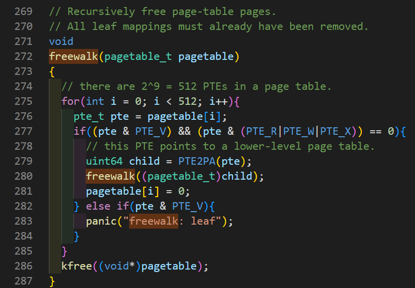
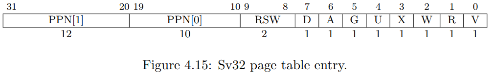

# Lab: page tables

这个实验中，你将会探索页表，修改它们去加速一些系统调用，查看那些页被访问过。

开始之前，需要将代码仓库切换到 `pgtbl` 分支。

```bash
git fetch
git checkout pgtbl
make clean
```

## Speed up system calls

这个实验的原理就是，将一些数据存放到一个只读的共享空间中，这个空间位于内核和用户之间。这样用户程序就不用陷入内核中，而是直接从这个只读的空间中获取数据，省去了一些系统开销，加速了一些系统调用。这次的任务是改进 `getpid()` 。

当每一个进程被创建，映射一个只读的页在 **USYSCALL** （在`memlayout.h`定义的一个虚拟地址）处。存储一个 `struct usyscall` （定义在 `memlayout.h`）结构体在该页的开始处，并且初始化这个结构体来保存当前进程的 PID。这个 lab 中，`ugetpid()` 已经在用户空间给出，它将会使用 **USYSCALL** 这个映射。运行 `pgtbltest` ，如果正确，`ugetpid` 这一项将会通过。（注意，这个程序包含两个测试，所以不用慌）。

首先在 `kernel/proc.h` proc 结构体中添加一项指针来保存这个共享页面的地址。

```c
struct proc {
...
  struct usyscall *usyscallpage;  // share page whithin kernel and user
...
}
```

 之后需要在 `kernel/proc.c` 的 `allocproc()` 中为其分配空间(`kalloc`)。并初始化其保存当前进程的PID。

```c
static struct proc*
allocproc(void) {
...
  if ((p->usyscallpage = (struct usyscall *)kalloc()) == 0) {
    freeproc(p);
    release(&p->lock);
    return 0;
  }

  p->usyscallpage->pid = p->pid;
  
  // Set up new context to start executing at forkret,
  // which returns to user space.
  memset(&p->context, 0, sizeof(p->context));
  p->context.ra = (uint64)forkret;
  p->context.sp = p->kstack + PGSIZE;
...
}
```

然后在 `kernel/proc.c` 的 `proc_pagetable(struct proc *p)` 中将这个映射（PTE）写入 pagetable 中。权限是用户态可读。

```c
pagetable_t
proc_pagetable(struct proc *p) {
...
    if(mappages(pagetable, USYSCALL, PGSIZE, (uint64)(p->usyscallpage), PTE_R | PTE_U) < 0) {
    uvmfree(pagetable, 0);
    return 0;
  }
  // map the trampoline code (for system call return)
  // at the highest user virtual address.
  // only the supervisor uses it, on the way
...
}
```

之后要确保释放进程的时候，能够释放该共享页。同样在 `kernel/proc.c` 中的 `freeproc(struct proc *p)` 。

```c
static void
freeproc(struct proc *p) {
  if(p->trapframe)
    kfree((void*)p->trapframe);
  p->trapframe = 0;
  // add start
  if(p->usyscallpage)
    kfree((void *)p->usyscallpage);
  p->usyscallpage = 0;
  // add end
  if(p->pagetable)
    proc_freepagetable(p->pagetable, p->sz);
}
```

此刻完成之后，运行 qemu 会 `panic` 错误。

```bash
xv6 kernel is booting

hart 2 starting
hart 1 starting
panic: freewalk: leaf
```


这是因为在 `pagetable` 中任然存在我们之前的 PTE 映射。我们需要在 `kernel/proc.c` 的 `proc_freepagetable(pagetable_t pagetable, uint64 sz)` 中对其取消映射。

```c
void
proc_freepagetable(pagetable_t pagetable, uint64 sz) {
  uvmunmap(pagetable, TRAMPOLINE, 1, 0);
  uvmunmap(pagetable, TRAPFRAME, 1, 0);
  uvmunmap(pagetable, USYSCALL, 1, 0); // add
  uvmfree(pagetable, sz);
}
```

具体的代码改动见 [github commit](https://github.com/flyto2035/xv6-labs-2022-solutions/commit/a4609f4237e864ce3c5085c8d4be4b3d00d637d8)。

> 注：`proc_pagetable(struct proc *p)` 中映射 PTE 时的权限应该为 `PTE_R | PTE_U` 而不是 `PTE_R | PTE_U | PTE_W`。

运行 `./grade-lab-pgtbl ugetpid` 即可得到成功信息。或者在 `qemu` 中运行 `pgtbltest` 。此时 `pgaccess_test` 会失败，这个是下面的任务。

## Print a page table

第二个任务是写一个函数来打印页表的内容。这个函数定义为 `vmprint()` 。它应该接收一个 `pagetable_t` 类型的参数，并且按照下面的格式打印。在 `exec.c` 中的 `return argc` 之前插入 `if(p->pid==1) vmprint(p->pagetable)` ，用来打印第一个进程的页表。

当你做完这些之后，运行 `qemu` 之后应该看到一下输出，它在第一个进程 `init` 完成之前打印出来。

```bash
page table 0x0000000087f6b000
 ..0: pte 0x0000000021fd9c01 pa 0x0000000087f67000
 .. ..0: pte 0x0000000021fd9801 pa 0x0000000087f66000
 .. .. ..0: pte 0x0000000021fda01b pa 0x0000000087f68000
 .. .. ..1: pte 0x0000000021fd9417 pa 0x0000000087f65000
 .. .. ..2: pte 0x0000000021fd9007 pa 0x0000000087f64000
 .. .. ..3: pte 0x0000000021fd8c17 pa 0x0000000087f63000
 ..255: pte 0x0000000021fda801 pa 0x0000000087f6a000
 .. ..511: pte 0x0000000021fda401 pa 0x0000000087f69000
 .. .. ..509: pte 0x0000000021fdcc13 pa 0x0000000087f73000
 .. .. ..510: pte 0x0000000021fdd007 pa 0x0000000087f74000
 .. .. ..511: pte 0x0000000020001c0b pa 0x0000000080007000
init: starting sh
```

注意点：

1. 可以将 `vmprint()` 实现到 `kernel/vm.c` 中。
2. 使用在 `kernel/riscv.h` 文件末尾的宏定义。
3. 函数 `freewalk` 的实现方法对本实验很有帮助。
4. 将函数 `vmprint` 的声明放到 `kernel/defs.h` 中，以便可以在 `exec.c` 中调用它。
5. 使用 `%p` 格式化打印64位十六进制的 PTEs 和 地址。

值得注意的是 `freewalk` 函数的具体实现。该函数会释放所有的页表（page-table pages），使用递归的形式访问到每一个子页面。



我们此次的 `vmprint` 函数也可以效仿此递归方法，但是需要展示此页表的深度，这时我们可以另外设置一个静态变量来指示当前打印页的深度信息，如果需要进入下一级页表就将其加一，函数返回就减一。具体实现如下：

```c
void
vmprint(pagetable_t pagetable)
{
  if (printdeep == 0)
    printf("page table %p\n", (uint64)pagetable);
  for (int i = 0; i < 512; i++) {
    pte_t pte = pagetable[i];
    if (pte & PTE_V) {
      for (int j = 0; j <= printdeep; j++) {
        printf("..");
      }
      printf("%d: pte %p pa %p\n", i, (uint64)pte, (uint64)PTE2PA(pte));
    }
    // pintes to lower-level page table
    if((pte & PTE_V) && (pte & (PTE_R|PTE_W|PTE_X)) == 0){
      printdeep++;
      uint64 child_pa = PTE2PA(pte);
      vmprint((pagetable_t)child_pa);
      printdeep--;
    }
  }
}
```

详细文件改动见：[github commit](https://github.com/flyto2035/xv6-labs-2022-solutions/commit/3343757349ffeff0c1d49a605bb4b6561a8d8ac5)

## Detect which pages have been accessed

首先需要了解的是，在一个 `Risc V Sv32` page table 包含了 2^10 个 PTEs，每一个 4 bytes。`Sv32` PTE 的图示如下：



参考 [RISC-V privileged architecture manual](https://github.com/riscv/riscv-isa-manual/releases/download/Ratified-IMFDQC-and-Priv-v1.11/riscv-privileged-20190608.pdf) 的 P68 及以下几页。

> Each leaf PTE contains an accessed (A) and dirty (D) bit. The A bit indicates the virtual page has been read, written, or fetched from since the last time the A bit was cleared. The D bit indicates the virtual page has been written since the last time the D bit was cleared.  

（A）位代表此虚拟页被访问（读，写，获取）自上次（A）位被清理（置零）。

这个实验中，我们将实现一个系统调用 `sys_pgaccess()` 在文件 `kernel/sysproc.c` 中。这个系统调用会告诉我们哪一个页被访问过。此系统调用接收三个参数。第一：被检查的第一个用户页的起始虚拟地址；第二：被检查页面的数量；第三：接收来自用户地址空间的一个 buffer 地址，将结果以掩码（bitmask）的形式写入。（掩码 bitmask 就是一个数据结构，其一个位代表一个页面，第一个页代表最低有效位）。

注意：

1. 在 `user/pgtlbtest.c` 的 `pgacess_test()` 展示了如何使用 `pgacess` 。
2. 使用 `argaddr()` 和 `argint()` 获取参数。
3. 对于要返回的 `bitmask` 值，在 kernel 中建立临时的buffer，然后使用 `copyout` 拷贝到用户空间（user space）。
4. 可以限制可以被扫描的页的最大数量（我的实现中没有设置）。
5. 在 `kernel/vm.c` 中的 `walk()` 很有用。它可以找到一个虚拟地址对应的 PTE，返回其 physical address。
6. 需要在 `kernel/riscv.h` 中定义一个 `PTE_A`，其为 `Risc V` 定义的 access bit。详细信息查看  [RISC-V privileged architecture manual](https://github.com/riscv/riscv-isa-manual/releases/download/Ratified-IMFDQC-and-Priv-v1.11/riscv-privileged-20190608.pdf) 。
7. 检查完 `PTE_A` 位时候设置之后，**确保将其清零**。因为如果不清零，那么这些位都将会被设置为 1 。因为检查其是否设置这个过程就访问了此页面，在之后的过程中不能确定该页面（被检查之前）是否被访问过。
8. `vmprint()` 可能会在调试页表时很有用。

`walk()` 函数的使用非常重要，它可以找到一个虚拟地址对应的 `PTE` 的地址。而我们就是需要检查 PTE 来判断其是否被访问过（`PTE_A` 是否被设置）。

另一个重要的是要在检查之后清零此 `PTE_A` 位，其在 `PTE` 的第 6 位（从零开始）。如何将一个二进制值的指定位设置为指定的值呢？


公式：`x = ((x&(1 << n)) ^ x) ^ (a << n)`，详细解释见文章：[如何将一个二进制值的指定位设置为指定的值](./doc/如何将一个二进制值的指定位设置为指定的值.md)。

实现如下：

```c
int
sys_pgaccess(void)
{
  uint64 va;
  int pagenum;
  uint64 abitsaddr;
  argaddr(0, &va);
  argint(1, &pagenum);
  argaddr(2, &abitsaddr);

  uint64 maskbits = 0;
  struct proc *proc = myproc();
  for (int i = 0; i < pagenum; i++) {
    pte_t *pte = walk(proc->pagetable, va+i*PGSIZE, 0);
    if (pte == 0)
      panic("page not exist.");
    if (PTE_FLAGS(*pte) & PTE_A) {
      maskbits = maskbits | (1L << i);
    }
    // clear PTE_A, set PTE_A bits zero
    *pte = ((*pte&PTE_A) ^ *pte) ^ 0 ;
  }
  if (copyout(proc->pagetable, abitsaddr, (char *)&maskbits, sizeof(maskbits)) < 0)
    panic("sys_pgacess copyout error");

  return 0;
}
```

全部文件改动见 [github commit](https://github.com/flyto2035/xv6-labs-2022-solutions/commit/4489995876d00a8b4de22b7e06d93daef25d09e5).
