# Lab: system calls

本实验将会学习如何使用 GDB 进行调试，以及实现两个系统调用函数（System Call）。

在开始之前，应该将 git 切换到 `syscall` 分支。

~~~bash
cd xv6-labs-2022
git checkout syscall
make clean
~~~

## Using gdb

首先应该学习如何使用 GDB 进行调试本 xv6。查看[此页面](https://pdos.csail.mit.edu/6.828/2022/labs/gdb.html)获得信息。

需要注意的是，在 Ubuntu 20.04.5 LTS 中，需要安装并使用 `gdb-multiarch`，只有这样才可以调试 `riscv64`程序。

进入 `xv6-labs-2022`文件夹中。

在终端中输入 `make qemu-gdb` ，这将运行 qemu 并开启调试功能，在这里，端口为本地的 **26000**。此时再打开一个终端，运行 `gdb-multiarch -x .gdbinit`。这将运行 `.gdbinit` 中的命令，也就是开启远程调试功能，并设置`arch`架构为 `riscv64`。具体可以查看此 `.gdbinit`文件。

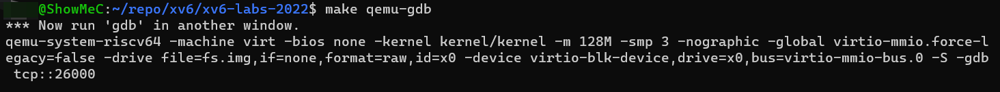

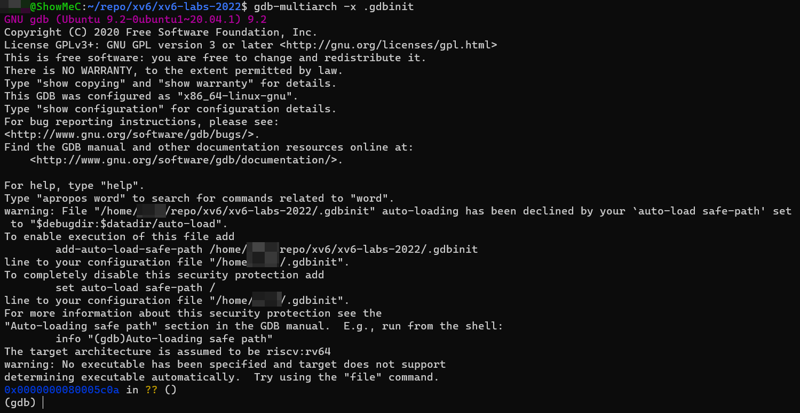

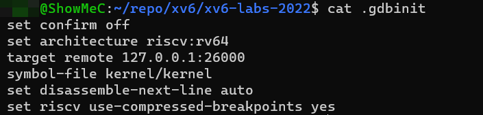

需要注意的是，如果 gdb 重新运行，那么 qemu 也应该重新运行。否则可能会出现意想不到的问题。

### 0x1

在 GDB 中运行以下指令。

~~~bash
(gdb) b syscall
Breakpoint 1 at 0x80001fe0: file kernel/syscall.c, line 133.
(gdb) c
Continuing.
[Switching to Thread 1.3]

Thread 3 hit Breakpoint 1, syscall () at kernel/syscall.c:133
133     {
(gdb) layout src
(gdb) backtrace
~~~

`b syscall` 将在函数 `syscall` 处设置断点； `c` 将会运行到此断点时等待调试指令；`layout src` 将会开启一个窗口展示调试时的源代码；`backtrace` 将会打印堆栈回溯（stack backtrace)。

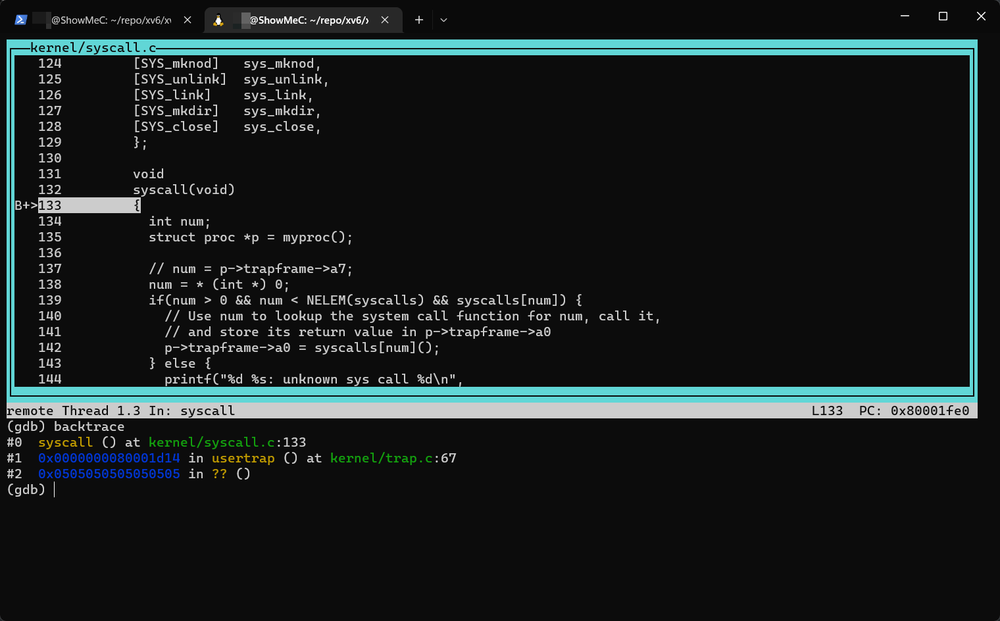

那么第一个问题：

> Looking at the backtrace output, which function called `syscall`?

通过堆栈回溯可以看到，函数 `usertrap()` 调用了 `syscall()` 函数。

### 0x2

输入几个`n` 命令，使其执行 `struct proc *p = myproc();` 并打印 `*p` 的值，它是一个 `proc` 结构体。

~~~bash
(gdb) n
(gdb) n
(gdb) p/x *p
~~~

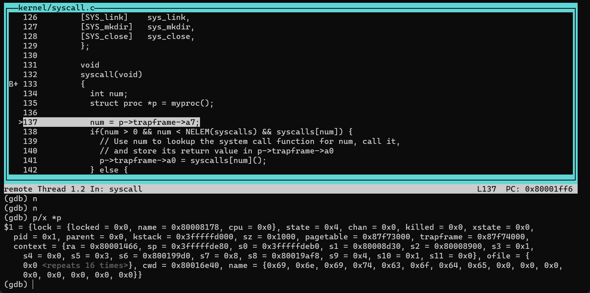

那么第二个问题：

> What is the value of `p->trapframe->a7` and what does that value represent? (Hint: look `user/initcode.S`, the first user program xv6 starts.)

输入命令查看 `p->trapframe->a7` 的值是多少。

~~~bash
(gdb) p p->trapframe->a7
$2 = 7
(gdb)
~~~

得到 `a7` 的值为 `7` 。根据参考教材 [xv6 book](https://pdos.csail.mit.edu/6.828/2022/xv6/book-riscv-rev1.pdf) 第二章和 `user/initcode.S` 中的代码可知，这个 `a7` 寄存器中保存了将要执行的系统调用号。这里的系统调用号为 `7`，在 `kernel/syscall.h` 中可以找到，这个系统调用为 `SYS_exec` 。

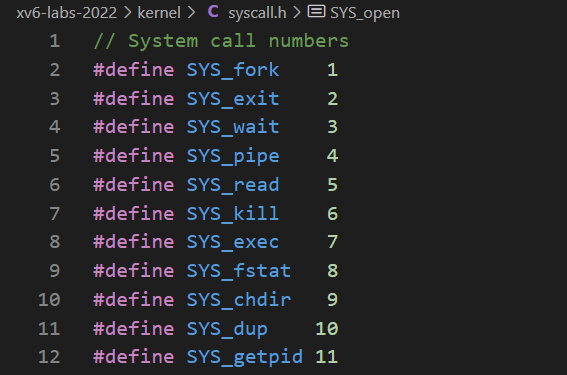

### 0x3

系统调用运行在内核模式（kernel mode)，可以通过 **Supervisor Status Register (sstatus)** 来查看当前 CPU 的状态。具体参看官方  [RISC-V privileged instructions](https://github.com/riscv/riscv-isa-manual/releases/download/Priv-v1.12/riscv-privileged-20211203.pdf) 文档 4.1.1 章节。

输入 GDB 命令来查看 `sstatus` 寄存器。通过 `p/t` 以二进制打印。

~~~bash
(gdb) p/t $sstatus
$4 = 100010
(gdb)
~~~

这是官方文档关于 `sstatus` 寄存器的图示。参考 [RISC-V Privilieged ISA](http://docs.keystone-enclave.org/en/latest/Getting-Started/How-Keystone-Works/RISC-V-Background.html#risc-v-privilieged-isa)。和以下解释：

>The SPP bit indicates the privilege level at which a hart was executing before entering supervisor mode. When a trap is taken, SPP is set to 0 if the trap originated from user mode, or 1 otherwise. When an SRET instruction (see Section 3.3.2) is executed to return from the trap handler, the privilege level is set to user mode if the SPP bit is 0, or supervisor mode if the SPP bit is 1; SPP is then set to 0.
>
>SPP 位指示进入管理员模式之前 hart 执行的特权级别。 当采取陷阱时，如果陷阱源自用户模式，则 SPP 设置为 0，否则设置为 1。 当执行 SRET 指令（见第 3.3.2 节）从陷阱处理程序返回时，如果 SPP 位为 0，则特权级别设置为用户模式，如果 SPP 位为 1，则设置为超级用户模式； 然后将 SPP 设置为 0。

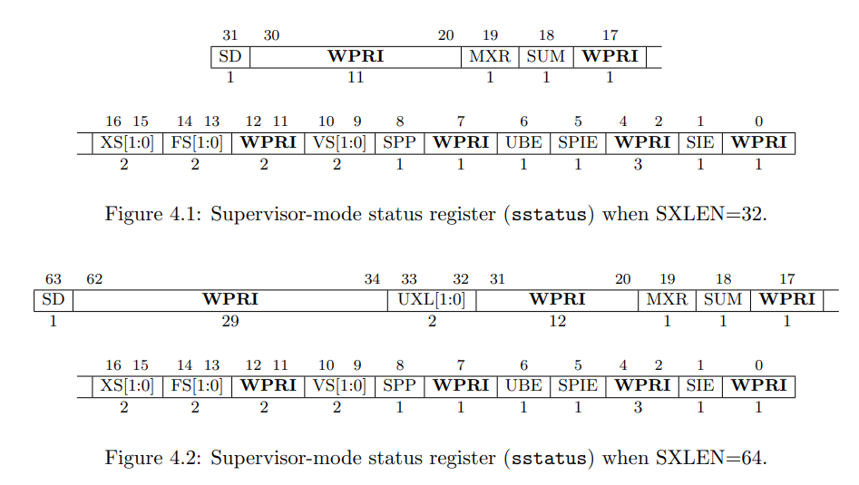

根据 `sstatus` 的二进制值 `100010` 可知，SPP 位是 `0`，那么在执行系统调用陷入内核之前的特权级别就是 user mode.

所以问题：

> What was the previous mode that the CPU was in?

答案就是：用户模式（User Mode）。

### 0x4

在后续的实验中，我们编写的代码可能会使内核崩溃(panic)。例如替换 `syscall()` 函数中的 `num = p->trapframe->a7;` 为 `num = * (int *) 0;`，然后运行 `make qemu`。这样会看到一个 panic 信息。

> 注：`syscall` 函数位于 `kernel/syscall.c` 132行。

~~~bash
xv6 kernel is booting

hart 2 starting
hart 1 starting
scause 0x000000000000000d
sepc=0x0000000080001ff4 stval=0x0000000000000000
panic: kerneltrap
~~~

这里的 `sepc` 指代内核发生 panic 的代码地址。可以在 `kernel/kernel.asm` 中查看编译后的完整内核汇编代码，在其中搜索这个地址既可以找到使内核 panic 的代码。`sepc` 的值不是固定不变的。

在这里是 `0x0000000080001ff4`，所以我在 `kernel/kernel.asm` 中搜索 `80001ff4`。

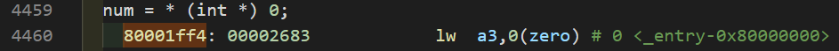

可以看到，果然是 `num = * (int *) 0;` 使内核 panic。对应的汇编则是 `lw a3,0(zero)`。一些 risc v 的汇编指令的简单介绍看这里 [RISC-V Assembly Language](https://web.eecs.utk.edu/~smarz1/courses/ece356/notes/assembly/)。

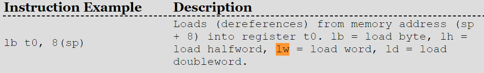

所以这条汇编代码代表：将内存中地址从 0 开始的一个字 word （2 bytes) 大小的数据加载到寄存器 `a3` 中。

那么问题：

> Write down the assembly instruction the kernel is panicing at. Which register corresponds to the varialable `num`?

答案就是：内核 panic 在 `lw a3,0(zero)`。`num` 代表 `a3` 寄存器。

0x5

再次运行虚拟器和 GDB 调试。将断点设置在发生 panic 处。

~~~bash
(gdb) b *0x0000000080001ff4
Breakpoint 1 at 0x80001ff4: file kernel/syscall.c, line 138.
(gdb) c
Continuing.

Thread 1 hit Breakpoint 1, syscall () at kernel/syscall.c:138
(gdb) layout asm
(gdb) n
(gdb) Ctrl + C # 键盘输入结束Thread
(gdb) p $scause
$1 = 13
~~~

再次输入 `n` 之后会发生 panic，此时输入 `Ctrl + C` 结束。查看 `scase` 寄存器，它代指内核 panic 的原因，查看文档[RISC-V privileged instructions](https://pdos.csail.mit.edu/6.828/2022/labs/n//github.com/riscv/riscv-isa-manual/releases/download/Priv-v1.12/riscv-privileged-20211203.pdf) 4.1.8 章节。下面是 Exception Code 图标。

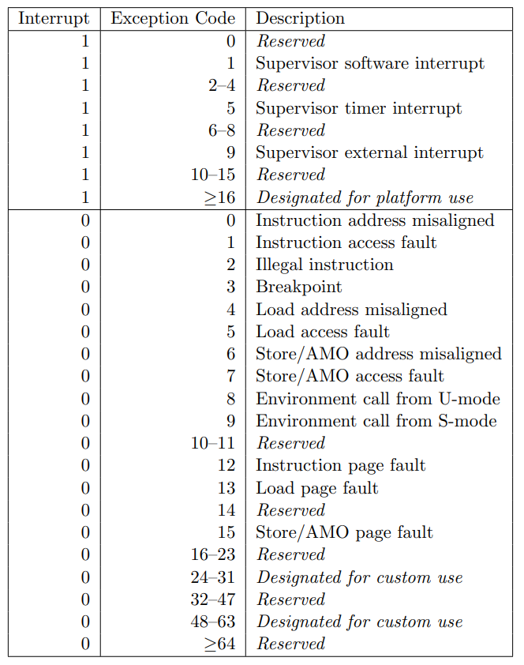

所以这里的 `13` 代表 `Load page fault` 。就是从内存地址 0 中 加载数据到寄存器 `a3` 时出错。那么地址 0 处是什么数据呢？从本教材 [book-riscv-rev3.pdf](https://pdos.csail.mit.edu/6.828/2022/xv6/book-riscv-rev3.pdf) 的 **Figure 3.3** 中可以找到答案。

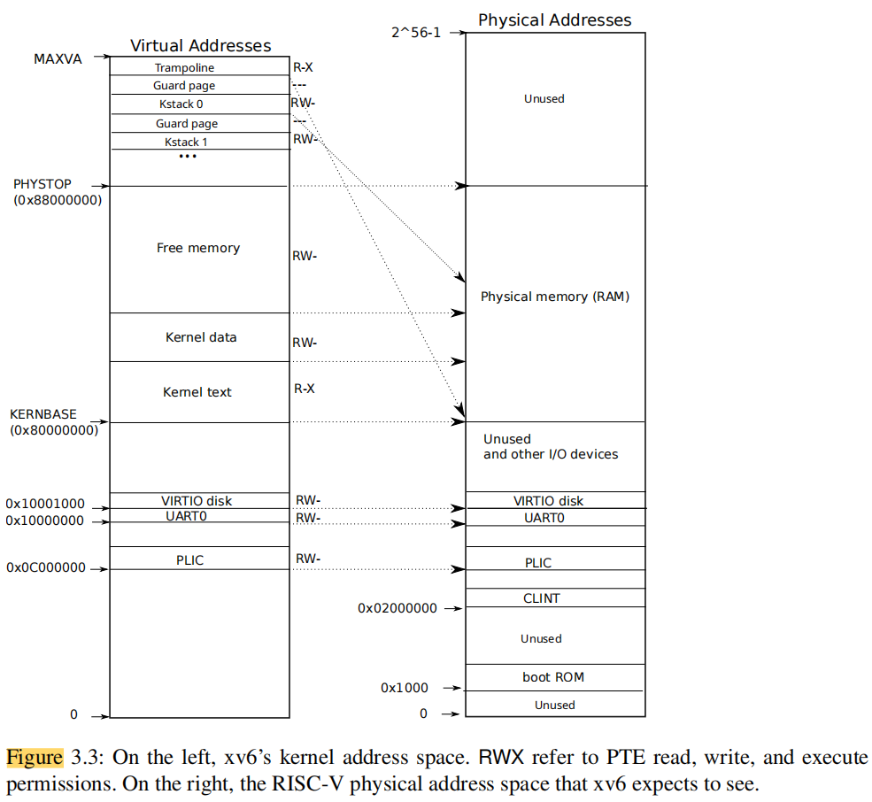

可以看到，在左侧 Virtual Address 中的地址 0 处对应右侧 Physical Address 的 Unused，表示这个地址没有被使用。而 Kernel 是从虚拟地址的 `0x80000000` 处开始的。

那么问题：

> Why does the kernel crash? Hint: look at figure 3-3 in the text; is address 0 mapped in the kernel address space? Is that confirmed by the value in `scause` above? (See description of `scause` in [RISC-V privileged instructions](https://pdos.csail.mit.edu/6.828/2022/labs/n//github.com/riscv/riscv-isa-manual/releases/download/Priv-v1.12/riscv-privileged-20211203.pdf))

答案：内核因为加载了一个未使用的地址 0 处的内存数据而崩溃（Load page fault）。地址 0 并不映射到内核空间中（从 `0x80000000` 开始）。`scause` 中的异常代码证实了上述观点。

### 0x5

上述 `scuase` 指明了内核 panic 的原因。但是有时候我们需要知道，是哪一个用户程序调用 syscall 时发生了 panic。这可以通过打印 `proc` 结构体中的 `name` 来查看。

重新启动 qemu 和 gdb。

~~~bash
(gdb) b syscall
Breakpoint 1 at 0x80001fe0: file kernel/syscall.c, line 133.
(gdb) c
Continuing.
[Switching to Thread 1.3]

Thread 3 hit Breakpoint 1, syscall () at kernel/syscall.c:133
133     {
(gdb) layout src
(gdb) n
(gdb) n
(gdb) p p->name
$1 = "initcode\000\000\000\000\000\000\000"
(gdb)
~~~

可以看到，这个用户程序是 `initcode` ，也是 xv6 第一个 process。

打印 `proc` 结构体可以查看这个进程的其他信息。

~~~bash
(gdb) p *p
$3 = {lock = {locked = 0, name = 0x80008178 "proc", cpu = 0x0}, state = RUNNING, chan = 0x0, killed = 0, xstate = 0,
  pid = 1, parent = 0x0, kstack = 274877894656, sz = 4096, pagetable = 0x87f73000, trapframe = 0x87f74000, context = {
    ra = 2147488870, sp = 274877898368, s0 = 274877898416, s1 = 2147519792, s2 = 2147518720, s3 = 1, s4 = 0, s5 = 3,
    s6 = 2147588560, s7 = 8, s8 = 2147588856, s9 = 4, s10 = 1, s11 = 0}, ofile = {0x0 <repeats 16 times>},
  cwd = 0x80016e40 <itable+24>, name = "initcode\000\000\000\000\000\000\000"}
(gdb)
~~~

可以看到，这个`initcode` 的 pid 为 1.

问题：

> What is the name of the binary that was running when the kernel paniced? What is its process id (`pid`)?

答案：这个二进制的名字为 `initcode` ，其 process id 为 1.

> 注：一些调试的方法可以看官网的PPT [Using the GNU Debugger](https://pdos.csail.mit.edu/6.828/2019/lec/gdb_slides.pdf) 和 [guidance page](https://pdos.csail.mit.edu/6.828/2022/labs/guidance.html) 。

## System call tracing

此任务会增加一个系统调用追踪功能，它将会在后续实验的调试时有所帮助。课程提供了一个 `trace` 程序，它将会运行并开始另一个程序的系统调用追踪功能（tracing enable），此程序位于 `user/trace.c`。其参数为一个掩码 mask ，用来指示其要追踪的系统调用。例如 `trace(1 << SYS_fork)`，`SYS_fork` 为系统调用号在文件 `kernel/syscall.h` 中。如果系统调用号被设置在掩码中，你必须修改 xv6 内核，当每一个追踪的系统调用将要返回的时候打印一行信息。这一行信息包含进程 id，系统调用的名字和要返回的值。你不需要打印系统调用的参数。`trace` 系统调用应该启用它调用的程序和它调用程序的每一个子程序的追踪功能，但是不能影响其他进程。

注意事项：

1. 将 `$U/_trace` 添加到 Makefile 的 UPROGS 中。
2. 运行 `make qemu` ，将会发现无法编译 `user/trace.c`，这是因为编译器无法找到这个 `trace` 系统调用的定义。在 `user/user.h` 中添加这个系统调用的函数原型；在 `user/usys.pl` 中添加一个 `entry` ，它将会生成 `user/usys.S` ，里面包含真实的汇编代码，它使用 Risc V 的 `ecall` 指令陷入内核，执行系统调用；在 `kernel/syscal.h` 中添加一个系统调用号。做完这些，`make qemu` 就不会报错了。
3. 在 `kernel/sysproc.c` 中添加一个 `sys_trace()` 函数作为系统调用。它通过将它的参数保存到 `proc` 结构体（见 `kernel/proc.h`）中的新变量中，来实现其功能。从用户空间获取系统调用参数的函数位于 `kernel/syscall.c` 中，用法例子见 `kernel/sysproc.c`。
4. 修改 `fork()` （位于 `kernel/proc.c`），从父程序拷贝追踪掩码（mask）到子进程。
5. 在 `kernel/syscall.c`修改 `syscall()`，以此来打印系统调用 trace。你需要添加一个系统调用名字数组，用来索引。

这个问题的关键在于，如何指定在 `syscall()` 函数中只打印指定 syscall number 的信息。那么这个掩码 mask 就很重要。

例如 `1 << SYS_read`，相当于 `1 << 5`，其二进制值为 `100000`，那么这个二进制的第五位（如果从 0 开始算）为 1，就证明 系统调用号为 5 的需要被打印。

又例如官网上的例子中 `trace trace 2147483647` 这里 `2147483647`就是二进制的 `01111111111111111111111111111111`，其低31为全部为 1 ，就证明 30号（包括30号）以下的系统调用都需要跟踪）。

可以使用一个 mask 来判断已知的系统调用是否需要跟踪打印。如下：

~~~c
if ( (mask >> num) & 0b1 )
    output
~~~

也就是判断那一位是否为 1 ，来判断其是否需要打印。

### 答案

文件变动见 [commit lab2 trace](https://github.com/flyto2035/xv6-labs-2022-solutions/commit/b18aa26959504c9634cf1a9c67753a048911cdd7)，共修改了 8 个文件。

可通过运行 `./grade-lab-syscall trace`  进行测试。

## Sysinfo

这个部分将会实现一个系统调用 `sysinfo`，它将收集正在运行的系统（xv6）的信息。此 system call 需要一个参数：一个指向 `struct sysinfo` 的指针（见 `kernel/sysinfo.h`）。在陷入内核后，内核将会填充这个结构体中的字段：`freemem` 使系统剩余内存（free  memory）的数量（单位 bytes），`nproc` 将会被设置为进程状态 `state` 不是 `UNSED` 的进程数量。我们提供了一个测试程序 `sysinfotest`，如果它打印 "sysinfotest: OK" ，那么就通过了测试。

注意事项：

1. 具体一般信息看官方的 hints。
2. `sysinfo` 有一个参数来自于用户空间 `use space` ，所以需要将内核空间（kernel space）中的数据（`struct sysinfo`）填充（复制）到用户空间中的结构体中。这个需要用到 `copyout`，具体例子请看 `sys_fstat()`(`kernel/sysfile.c`) 和 `filestat()`(`kernel/file.c`)。
3. 在 `kernel/kalloc.c` 中添加一个函数用于计算未使用的空闲内存。
4. 在 `kernel/proc.c` 中添加一个函数用于收集进程数量。
5. 这些函数的实现，可以参考其他官方的函数，会有一些启发。

### 答案

文件改动见 [commit lab2 sysinfo](https://github.com/flyto2035/xv6-labs-2022-solutions/commit/ed66024c7020638bf201d0e11599c246a4db5f4f)，共修改了 9 个文件。

可通过运行 `./grade-lab-syscall sysinfo  进行测试。
