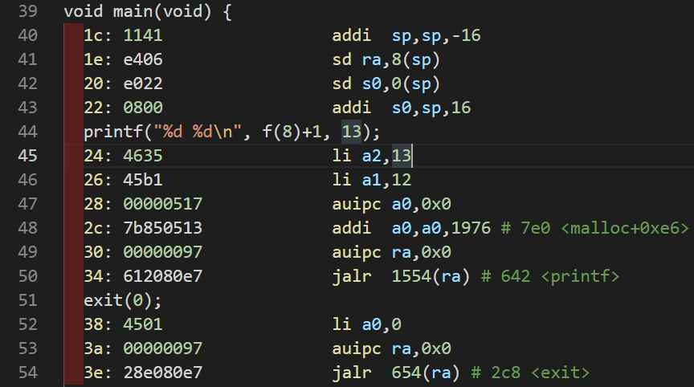
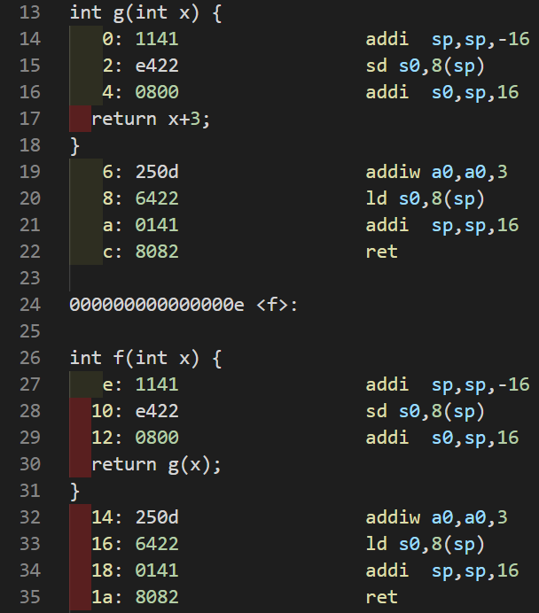
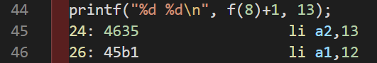
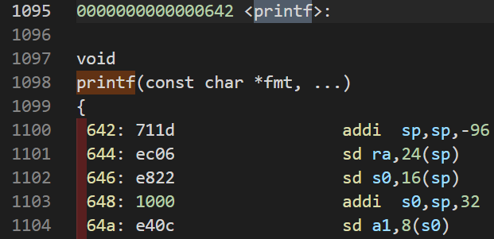
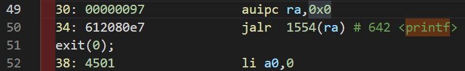

# Lab: traps

这个实验将会探索系统调用是如何使用陷阱（trap）实现的。首先将会利用栈做一个热身练习，接下来你将会实现一个用户级陷阱处理（user-level trap handling）的例子。

> 阅读  [xv6 book](https://pdos.csail.mit.edu/6.828/2022/xv6/book-riscv-rev3.pdf) 第四章节和以下相关文件：
>
> - `kernel/trampoline.S` ：从用户空间到内核空间并返回的汇编代码。
> - `kernel/trap.c`：处理所有中断的代码。

开始之前，切换到 `trap` 分支。

```bash
git fetch
git checkout traps
make clean
```

## RISC-V assembly

理解 RISC-V 的汇编代码很重要。使用命令 `make fs.img` 编译 `user/call.c` ，这将会生成一个可读的汇编代码文件 `user/call.asm` 。

阅读 `call.asm` 中的 `g` ，`f` ，和 `main` 函数。参考这些材料：[reference page](https://pdos.csail.mit.edu/6.828/2022/reference.html)。

### 0x1

> Which registers contain arguments to functions? For example, which register holds 13 in main's call to `printf`?

通过之前的阅读可知，调用函数时的参数传递使用寄存器 `a1`, `a2` 等通用寄存器。

阅读 `call.asm` 文件的第 45 行。



通过阅读 `call.asm` 文件中的 `main` 函数可知，调用 `printf` 函数时，`13` 被寄存器 `a2` 保存。

答案：

`a1`, `a2`, `a3` 等通用寄存器；`13` 被寄存器 `a2` 保存。

### 0x2

> Where is the call to function `f` in the assembly code for main? Where is the call to `g`? (Hint: the compiler may inline functions.)

通过阅读函数 `f` 和 `g` 得知：函数 `f` 调用函数 `g` ；函数 `g` 使传入的参数加 3 后返回。



所以总结来说，函数 `f` 就是使传入的参数加 3 后返回。考虑到编译器会进行内联优化，这就意味着一些显而易见的，编译时可以计算的数据会在编译时得出结果，而不是进行函数调用。

查看 `main` 函数可以发现，`printf` 中包含了一个对 `f` 的调用。



但是对应的会汇编代码却是直接将 `f(8)+1` 替换为 `12` 。这就说明编译器对这个函数调用进行了优化，所以对于 `main` 函数的汇编代码来说，其并没有调用函数 `f` 和 `g` ，而是在运行之前由编译器对其进行了计算。

答案：

`main` 的汇编代码没有调用 `f` 和 `g` 函数。编译器对其进行了优化。

### 0x3

> At what address is the function `printf` located?

通过搜索容易得到 `printf` 函数的位置。



得到其地址在 `0x642`。

答案：

`0x642`

### 0x4

> What value is in the register `ra` just after the `jalr` to `printf` in `main`?

`auipc` 和 `jalr` 的配合，可以跳转到任意 32 位的地址。



具体相关命令介绍请看参考链接：[reference1](https://xiayingp.gitbook.io/build_a_os/hardware-device-assembly/risc-v-assembly), [RISC-V unprivileged instructions](https://github.com/riscv/riscv-isa-manual/releases/download/Ratified-IMAFDQC/riscv-spec-20191213.pdf).

第 49 行，使用 `auipc ra,0x0` 将当前程序计数器 `pc` 的值存入 `ra` 中。

第 50 行，`jalr 1554(ra)` 跳转到偏移地址 `printf` 处，也就是 `0x642` 的位置。

根据 [reference1](https://xiayingp.gitbook.io/build_a_os/hardware-device-assembly/risc-v-assembly) 中的信息，在执行完这句命令之后， 寄存器 `ra` 的值设置为 `pc + 4` ，也就是 `return address` 返回地址 `0x38`。

答案：

`jalr` 指令执行完毕之后，`ra` 的值为 `0x38`.

### 0x5

> Run the following code.
>
> ```c
> unsigned int i = 0x00646c72;
> printf("H%x Wo%s", 57616, &i);
> ```
>
> What is the output? [Here's an ASCII table](https://www.asciitable.com/) that maps bytes to characters.
>
> The output depends on that fact that the RISC-V is little-endian. If the RISC-V were instead big-endian what would you set `i` to in order to yield the same output? Would you need to change `57616` to a different value?
>
> [Here's a description of little- and big-endian](http://www.webopedia.com/TERM/b/big_endian.html) and [a more whimsical description](https://www.rfc-editor.org/ien/ien137.txt).

请查看在线 C Compiler 的运行结果 [c++ sell](https://cpp.sh/?source=%2F%2F+Example+program%0A%23include+%3Cstdio.h%3E%0A%0Aint+main()%0A%7B%0A++unsigned+int+i+%3D+0x00646c72%3B%0Aprintf(%22x%3D%25d+y%3D%25d%22%2C+3)%3B%0Areturn+0%3B%0A%7D)，它打印出了 `He110 World`。

首先，`57616` 转换为 16 进制为 `e110`，所以格式化描述符 `%x` 打印出了它的 16 进制值。

其次，如果在小端（little-endian）处理器中，数据`0x00646c72` 的**高字节存储在内存的高位**，那么从**内存低位**，也就是**低字节**开始读取，对应的 ASCII 字符为 `rld`。

如果在 大端（big-endian）处理器中，数据 `0x00646c72` 的**高字节存储在内存的低位**，那么从**内存低位**，也就是**高字节**开始读取其 ASCII 码为 `dlr`。

所以如果大端序和小端序输出相同的内容 `i` ，那么在其为大端序的时候，`i` 的值应该为 `0x726c64`，这样才能保证从内存低位读取时的输出为 `rld` 。

无论  `57616` 在大端序还是小端序，它的二进制值都为 `e110` 。大端序和小端序只是改变了多字节数据在内存中的存放方式，并不改变其真正的值的大小，所以 `57616` 始终打印为二进制 `e110` 。

关于大小端，参考：[CSDN](https://blog.csdn.net/wwwlyj123321/article/details/100066463)

答案：

如果在大端序，`i` 的值应该为 `0x00646c72` 才能保证与小端序输出的内容相同。不用该变 `57616` 的值。

### 0x6

> In the following code, what is going to be printed after `'y='`? (note: the answer is not a specific value.) Why does this happen?
>
> ```c
> printf("x=%d y=%d", 3);
> ```

通过之前的章节可知，函数的参数是通过寄存器`a1`, `a2` 等来传递。如果 `prinf` 少传递一个参数，那么其仍会从一个确定的寄存器中读取其想要的参数值，但是我们并没有给出这个确定的参数并将其存储在寄存器中，所以函数将从此寄存器中获取到一个随机的不确定的值作为其参数。故而此例中，`y=`后面的值我们不能够确定，它是一个垃圾值。

答案：

`y=` 之后的值为一个不确定的垃圾值。

## Backtrace

打印出 `backtrace`，这是一个在错误发生时存在于栈中的函数调用列表，有利于调试。寄存器 `s0` 包含一个指向当前栈帧 `stack frame` 的指针，我们的任务就是使用栈帧遍历整个栈，打印每一个栈帧中的返回地址 `return address`。

实现一个 `backtrace()` 函数在 `kernel/printf.c` 中，并且在 `sys_sleep` 中调用它。之后运行 `bttest`，它将会调用 `sys_sleep` 。你和输出应该是一个**返回地址**列表，就像下面那样（可能数字会不同）：

```bash
backtrace:
0x0000000080002cda
0x0000000080002bb6
0x0000000080002898
```

注意事项：

1. 在 `kernel/defs.h` 中添加函数 `backtrace()` 的函数声明，以便在 `sys_sleep` 中调用 `backtrace`。

2. GCC 编译器将当前正在执行的函数的帧指针（frame pointer）存储到寄存器 `s0` 中。在 `kernel/riscv.h` 中添加以下代码：

   1. ```bash
      static inline uint64
      r_fp()
      {
        uint64 x;
        asm volatile("mv %0, s0" : "=r" (x) );
        return x;
      }
      ```

   2. 在 `backtrace` 中调用此函数，将会读取当前帧指针。`r_fp()` 使用[内联汇编](https://gcc.gnu.org/onlinedocs/gcc/Using-Assembly-Language-with-C.html)读取 `s0`。

3. [课堂笔记](https://pdos.csail.mit.edu/6.1810/2022/lec/l-riscv.txt)中有关于栈帧的布局图片。注意，返回地址在帧指针的 -8 偏移量处；前一个帧指针位于当前帧指针的固定偏移量 (-16) 处。

4. 遍历栈帧需要一个停止条件。有用的信息是：每个内核栈由一整个页（4k对其）组成，所有的栈帧都在同一个页上面。你可以使用`PGROUNDDOWN(fp)` 来定位帧指针所在的页面，从而确定循环停止的条件。

> `PGROUNDDOWN(fp)` 总是表示 `fp` 所在的这一页的起始位置。

所以要在 `printf` 中添加该函数：

```c
void
backtrace(void)
{
  uint64 fp_address = r_fp();
  while(fp_address != PGROUNDDOWN(fp_address)) {
    printf("%p\n", *(uint64*)(fp_address-8));
    fp_address = *(uint64*)(fp_address - 16);
  }
}
```

在 `kernel/defs.h` 中添加该函数声明：

```c
void            backtrace(void);
```

在 `kerne/riscv.h` 中添加 `r_sp`函数。

```c
static inline uint64
r_sp()
{
  uint64 x;
  asm volatile("mv %0, sp" : "=r" (x) );
  return x;
}
```

在 `kernel/sysproc.c` 中的 `sys_sleep` 函数中添加该函数调用：

```c
void sys_sleep(void){
    ...
    backtrace();
    ...
}
```

具体文件变动见 [github commit](https://github.com/flyto2035/xv6-labs-2022-solutions/commit/c636291e238bc849a6ac9638dfd2a8e922c4febe).

## Alarm

这个练习将会添加一个特性：当一个进程使用 cpu 时，每隔一个特定的时间就提醒进程。如果我们想要限制一个进程使用 cpu 的时间，那么这个练习将会有帮助。

你应该添加一个新的系统调用  `sigalarm(interval, handler)`。如果一个应用调用了 `sigalarm(n, fn)`那么这个进程每消耗 `n` 个 ticks，内核应该确保函数 `fn` 被调用。当 `fn` 返回的时候，内核应该恢复现场，确保该进程在它刚才离开的地方继续执行。一个 tick 在 xv6 中是一个相当随意的单位时间，它取决于硬件时钟产生中断的快慢。如果一个应用调用 `sigalarm(0, 0)` ，内核应该停止产生周期性的警报调用。

在代码库中有 `user/alarmtest.c` 程序用于检测实验的真确性。将它添加到 Makefile 文件中以便编译它。

`alarmtest` 在 `test0` 中调用  `sigalarm(2, periodic)` ，使内核每隔 2 个 ticks 就调用 `periodic` 函数。

### test0: invoke handler

通过修改内核，使得内核可以调转到位于用户空间的处理函数（alarm handler），它将打印出 "alarm!" 字符。

回忆一下之前的内容以及 xv6 book 中的第四章节的内容。当使用 trap 方式陷入内核的时候，会首先执行 `kernel/trampoline.S` 中的 `uservec` ，保存寄存器中的值以便返回时恢复现场，包括 `sepc` 中断时保存的用户程序的程序计数器（pc）；然后跳转到 `kernel/trap.c` 中的 `usertrap(void)` ，检测该中断的类型（是否是系统调用或者是 timer 时钟中断）；然后跳转到 `kernel/trap.c` 中的 `usertrapret(void)` ，它将从之前保存的栈帧(trapframe) 中恢复寄存器，其中一个重要的就是 `pec` ，CPU 从 特权模式 返回 用户模式 ，将使用 `spec` 的值恢复 `pc` 的值，它决定了返回时，CPU 将要执行的用户代码。这一点很重要，我们的代码也是利用这一点，使 CPU 执行我们定义的用户空间中的 alarm handler 函数。

需要注意的是，为了使得从 alarm handler 中返回之后，仍继续执行原用户程序，我们需要保存之前保存在 `trapframe` 中的寄存器值，并且在 alarm handler 调用 `sys_sigreturn` 时恢复这些寄存器。

另外，为了保证实验说明中的要求：在 alarm handler 函数未返回之前，不能重复调用 alarm handler。我们需要一个控制这个状态的变量`have_return`，它将会添加到 `struct proc` 中。

首先在 `kernel/proc.h` 中的 `proc` 结构体中添加需要的内容。

```c
struct proc {
    ...
  // the virtual address of alarm handler function in user page
  uint64 handler_va;
  int alarm_interval;
  int passed_ticks;
  // save registers so that we can re-store it when return to interrupted code.   
  struct trapframe saved_trapframe;
  // the bool value which show that is or not we have returned from alarm handler.
  int have_return;
    ...
}
```

在 `kernel/sysproc.c` 中实现 `sys_sigalarm` 和 `sys_sigreturn` 。

```c
uint64
sys_sigreturn(void)
{
  struct proc* proc = myproc();
  // re-store trapframe so that it can return to the interrupt code before.
  *proc->trapframe = proc->saved_trapframe;
  proc->have_return = 1; // true
  return proc->trapframe->a0;
}

uint64
sys_sigalarm(void)
{
  int ticks;
  uint64 handler_va;

  argint(0, &ticks);
  argaddr(1, &handler_va);
  struct proc* proc = myproc();
  proc->alarm_interval = ticks;
  proc->handler_va = handler_va;
  proc->have_return = 1; // true
  return 0;
}
```

注意到一点，`sys_sigreturn(void)` 的返回值不是 0，而是 `proc->trapframe->a0`。这是因为我们想要完整的恢复所有寄存器的值，包括 `a0`。但是一个系统调用返回的时候，它会将其返回值存到 `a0` 寄存器中，那这样就改变了之前 `a0` 的值。所以，我们干脆让其返回之前想要恢复的 `a0` 的值，那这样在其返回之后 `a0` 的值仍没有改变。 

然后修改 `kernel/trap.c` 中的 `usertrap` 函数。

```c
void
usertrap(void) {
  ...
    // give up the CPU if this is a timer interrupt.
  if(which_dev == 2) {
    struct proc *proc = myproc();
    // if proc->alarm_interval is not zero
    // and alarm handler is returned.
    if (proc->alarm_interval && proc->have_return) {
      if (++proc->passed_ticks == 2) {
        proc->saved_trapframe = *p->trapframe;
        // it will make cpu jmp to the handler function
        proc->trapframe->epc = proc->handler_va;
        // reset it
        proc->passed_ticks = 0;
        // Prevent re-entrant calls to the handler
        proc->have_return = 0;
      }
    }
    yield();
  }
  ...
}
```

从内核跳转到用户空间中的 alarm handler 函数的关键一点就是：修改 `epc` 的值，使 trap 在返回的时候将 pc 值修改为该 alarm handler 函数的地址。这样，我们就完成了从内核调转到用户空间中的 alarm handler 函数。但是同时，我们也需要保存之前寄存器栈帧，因为后来 alarm handler 调用系统调用 `sys_sigreturn` 时会破坏之前保存的寄存器栈帧(p->trapframe)。

具体代码改动见：[github commit](https://github.com/flyto2035/xv6-labs-2022-solutions/commit/8dd68907b38ac6dbecfc93c4a452e6acb07313bd).
